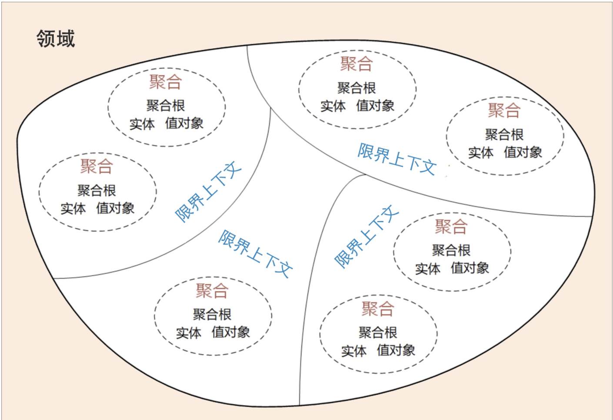

# 事件风暴

事件风暴是建立领域模型的主要方法，它是一个**从发散到收敛的过程**。

事件风暴通常采用用例分析、场景分析和用户旅程分析，尽可能全面不遗漏地分解业务领域，并梳理领域对象之间的关系，这是一个**发散**的过程。

事件风暴过程会产生很多的实体、命令、事件等领域对象，我们将这些领域对象从不同的维度进行聚类，形成如聚合、限界上下文等边界，建立领域模型，这就是一个**收敛**的过程。

**可以用三步来划定领域模型和微服务的边界。**

第一步：在事件风暴中梳理业务过程中的用户操作、事件以及外部依赖关系等，根据这些要素梳理出领域实体等**领域对象**。

第二步：根据领域实体之间的业务关联性，将业务紧密相关的实体进行组合形成**聚合**，同时确定聚合中的聚合根、值对象和实体。在这个图里，聚合之间的边界是第一层边界，它们在同一个微服务实例中运行，这个边界是逻辑边界，所以用虚线表示。

第三步：根据业务及语义边界等因素，将一个或者多个聚合划定在一个**限界上下文内，形成领域模型**。在这个图里，限界上下文之间的边界是第二层边界，这一层边界可能就是未来微服务的边界，不同限界上下文内的领域逻辑被隔离在不同的微服务实例中运行，物理上相互隔离，所以是物理边界，边界之间用实线来表示。