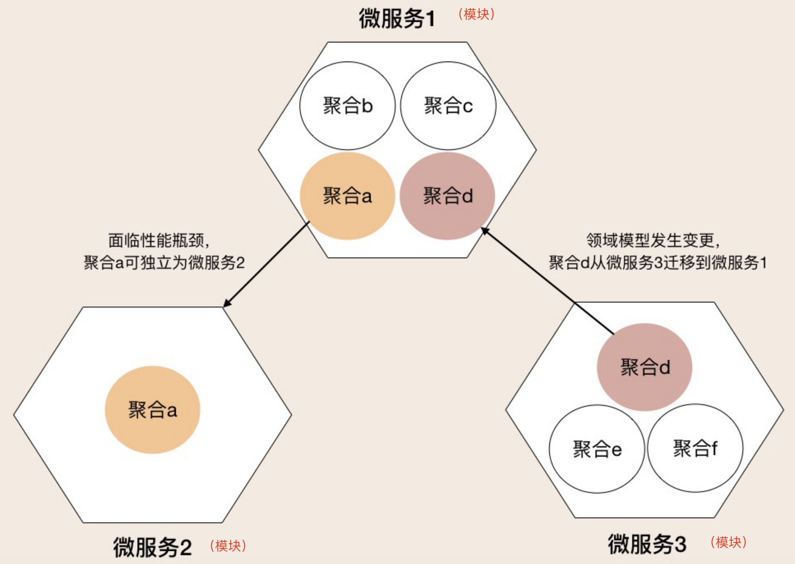
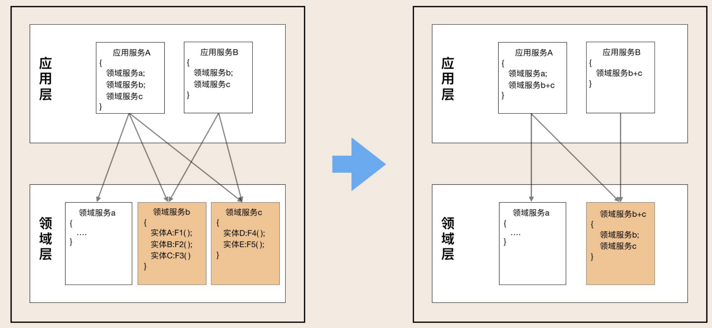
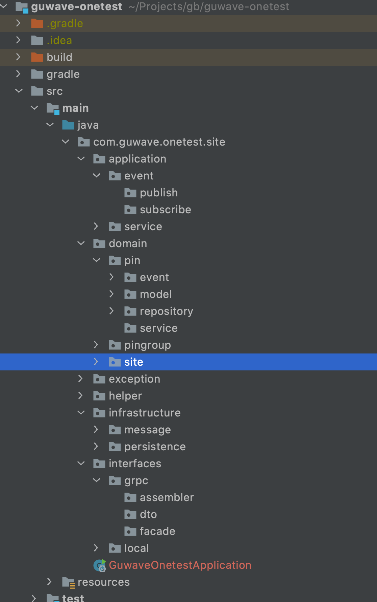

架构模型有很多种，如Clean架构、六边形架构、CQRS架构等等，每种架构的核心理念都是解决“高内聚低耦合”的问题。DDD 分层架构的出现，解决了如何将业务建模映射为技术实现的问题，使得架构的依赖和每一层职责更清晰。作为与DDD配套的一种架构，是每一个DDD学习人员都应该掌握的。

# 1. 传统分层架构与DDD 分层架构对比

传统的分层架构包括三层架构和四层架构，作为大家经常接触的两中架构，其架构模型如下图所示：

传统的分层架构

传统的分层架构有如下特点：

- 基础设施层位于最底层，在分层上位于最核心的位置
- 在非严格的依赖限制下，上层可以依赖所有的下层，层与层之间的隔离并不严格

DDD的分层架构采用依赖倒置原则将基础设施层提到最上层，从架构层次上看其重要性最低，同时也可以避免基础设施对业务代码的侵入，其架构图如下所示：

DDD分层架构

DDD分层架构的特点：

- 通过依赖倒置将基础设施层放到最外层
- 领域层处于架构的最底层，成为了最核心的业务逻辑
- 除了基础设施层可以依赖于各层之外，其他层只能依赖于下面一层，不能跨层依赖

结合DDD的中的术语，将DDD分层架构进一步打开，如下图所示：

DDD分层架构之技术架构图

# 2. DDD分层架构解释

DDD分层架构的一个重要原则是“**每层只能与位于其下方的层发生耦合**”（即DDD分层采用严格的分层架构）。DDD分层架构中包括4层，各层的作用如下：

【1】基础设施层

基础设施层可以依赖其它所有层，其主要为其它各层提供通用的技术和基础服务，如数据库、缓存、消息中间件、基础服务等。

基础设施层最常用到的功能是提供数据持久化，采用依赖倒置设计，实现领域层定义的数据持久化接口，从而实现其它层与基础设施解耦的目的，降低外部资源变化对其它各层的影响。

【2】应用接口层

应用接口层负责向外提供可调用的接口，接收用户（这里的用户包括实际的用户、三方程序、定时器等）的请求和返回处理结果，同时还能判断用户请求的参数的合法性。

【3】应用服务层

用户服务层主要关注用例和流程，通过编排多个聚合根或领域服务来完成用例和流程的业务功能。此外，应用服务层还负责如下功能：

- 完成微服务之间的编排
- 发送和接受其他服务的领域事件
- 权限控制和事务

应用服务层是很薄的一层，向外暴露粗粒度的接口，不应该还有任何的业务规则和逻辑。切记不要将本该放在领域层的业务逻辑放到应用层中实现。否则庞大的应用服务层会使领域模型失焦，久而久之微服务就会演化为传统的三层架构，业务逻辑会变得混乱。

【4】领域层

领域层关注的是业务的核心逻辑，由聚合根、实体、值对象和领域服务来实现，封装的是业务功能、状态和规则，通过聚合根来实现数据的一致性。

在实现领域层时，业务功能和规则主要采用实体和领域服务来实现，其中实体采用充血模型来实现，如果单一的实体无法实现业务功能时，需要使用领域服务来编排聚合根内的实体（或值对象）以实现复杂的业务功能。

# 3. DDD分层架够协助进程间架构演进

# 4. DDD分层架构推动进程内架构演进

一个上下文可能包含多个聚合，因此可以抽象出公共的跨聚合的领域服务。

# 5. 代码模型

## 5.1 接口层

根据微服务提供的不同接口类型，如RESTful，GRPC，包含不同的子目录（如RESTful类型接口的子目录可以叫web），每个子目录包含以下三个目录。

**assembler：**实现 DTO 与领域对象之间的相互转换和数据交换。一般来说 Assembler 与DTO 总是一同出现。

**dto：**它是数据传输的载体，内部不存在任何业务逻辑，我们可以通过 DTO 把内部的领域对象与外界隔离。

**facade：**提供较粗粒度的调用接口，将用户请求委派给一个或多个应用服务进行处理。

## 5.2 应用层

**event：**这层目录主要存放事件相关的代码。它包括两个子目录：publish 和subscribe。前者主要存放事件发布相关代码，后者主要存放事件订阅相关代码（事件处理相关的核心业务逻辑在领域层实现）。

虽然应用层和领域层都可以进行事件的发布和处理，但为了实现事件的统一管理，建议将微服务（模块）内所有事件的发布和订阅的处理都统一放到应用层，事件相关的核心业务逻辑实现放在领域层。通过应用层调用领域层服务，来实现完整的事件发布和订阅处理流程。

**service（应用服务）：**这层的服务是应用服务。应用服务会对多个领域服务或外部应用服务进行封装、编排和组合，对外提供粗粒度的服务。应用服务主要实现服务组合和编排，是一段独立的业务逻辑。你可以将所有应用服务放在一个应用服务类里，也可以把一个应用服务设计为一个应用服务类，以防应用服务类代码量过大。

## 5.3 领域层

domain 是由一个或多个聚合包构成，共同实现领域模型的核心业务逻辑。聚合内的代码模型是标准和统一的，包括：model、event、repository 和 service 四个子目录。

**aggregate（聚合）：**它是聚合软件包的根目录，可以根据实际项目的聚合名称命名。在聚合内定义聚合根、实体和值对象以及领域服务之间的关系和边界。聚合内实现高内聚的业务逻辑，它的代码可以独立拆分为微服务（模块）。

以聚合为单位的代码放在一个包里的主要目的是为了业务内聚，而更大的目的是为了以后微服务（模块）之间聚合的重组。聚合之间清晰的代码边界，可以让你轻松地实现以聚合为单位的微服务（模块）重组，在微服务（组件化）架构演进中有着很重要的作用。

**model：**它存放聚合根、实体、值对象以及工厂模式（Factory）相关代码。实体类采用充血模型，同一实体相关的业务逻辑都在实体类代码中实现。跨实体的业务逻辑代码在领域服务中实现。

**event：**它存放事件实体以及与事件活动相关的业务逻辑代码。

**service（领域服务）：**它存放领域服务代码。一个领域服务是多个实体组合出来的一段业务逻辑。你可以将聚合内所有领域服务都放在一个领域服务类中，你也可以把每一个领域服务设计为一个类。如果领域服务内的业务逻辑相对复杂，建议将一个领域服务设计为一个领域服务类，避免由于所有领域服务代码都放在一个领域服务类中，而出现代码臃肿的问题。领域服务封装多个实体或方法后向上层提供应用服务调用。

**repository（仓储）：**它存放所在聚合的查询或持久化领域对象的代码，通常包括仓储接口和仓储实现方法。为了方便聚合的拆分和组合，我们设定了一个原则：一个聚合对应一个仓储。

*注：按照 DDD 分层架构，仓储实现本应该属于基础层代码，但为了在微服务（组件化）架构演进时，保证代码拆分和重组的便利性，可以把聚合仓储实现的代码放到了聚合包内。这样，如果需求或者设计发生变化导致聚合需要拆分或重组时，我们就可以将包括核心业务逻辑和仓储代码的聚合包整体迁移，轻松实现微服务（组件化）架构演进。*

## 5.4 基础设施层

Infrastructure 的代码目录结构有：message 和 persistent 等子目录。

**message**：主要放置消息相关的类，如消息总线接口的实现。

**persistent**：放置domain层repository接口的实现类，可以根据不同的数据库或ORM框架继续包含不同的子目录，如xml, jpa, mapper等。