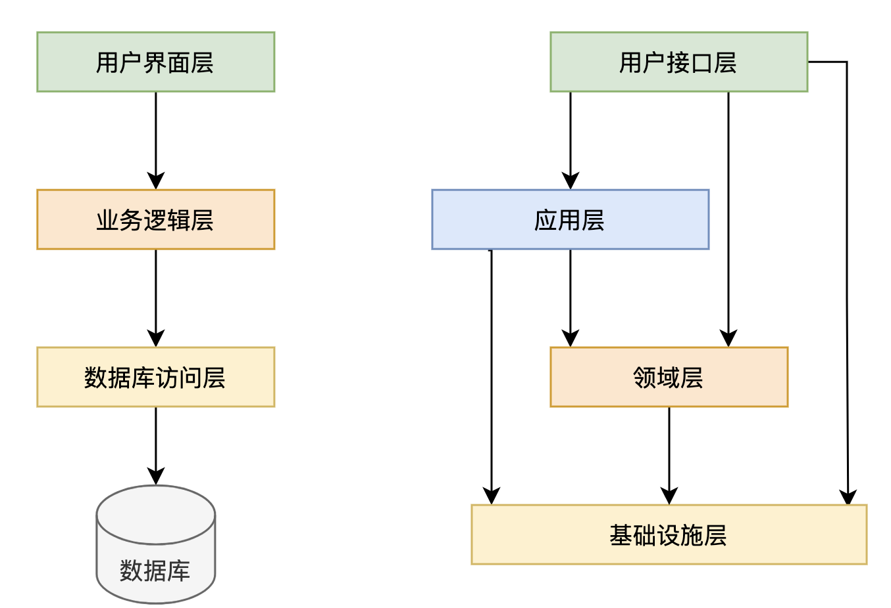
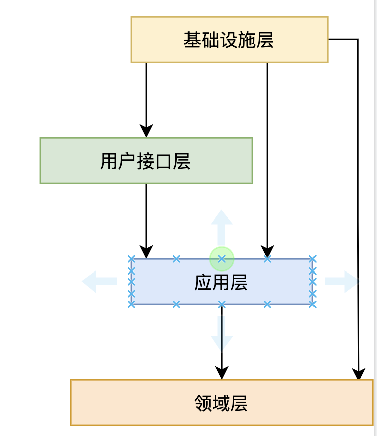
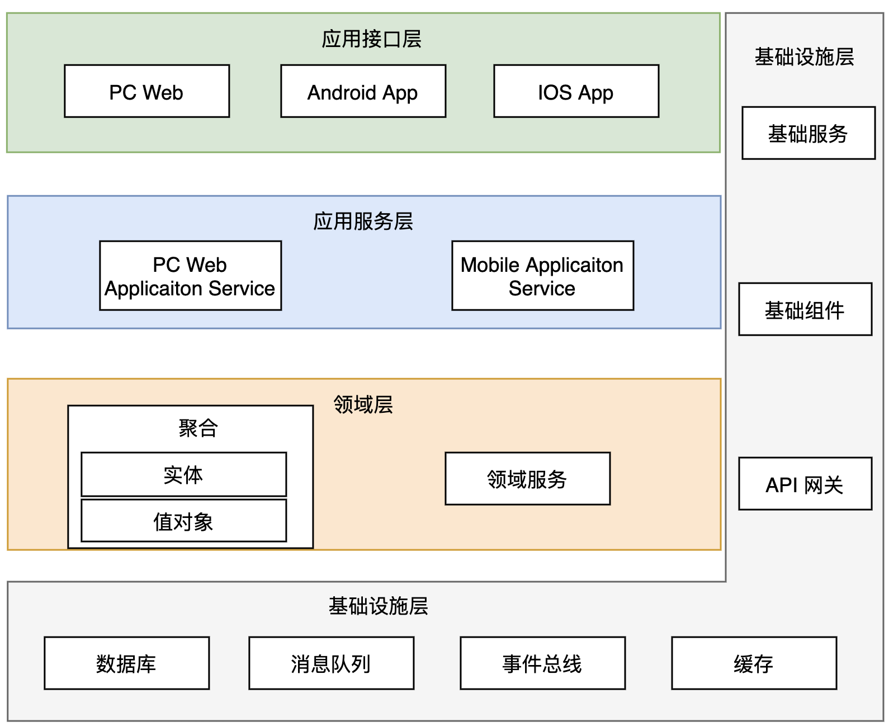

架构模型有很多种，如Clean架构、六边形架构、CQRS架构等等，每种架构的核心理念都是解决“高内聚低耦合”的问题。DDD 分层架构的出现，解决了如何将业务建模映射为技术实现的问题，使得架构的依赖和每一层职责更清晰。作为与DDD配套的一种架构，是每一个DDD学习人员都应该掌握的。

# 1. 传统分层架构与DDD 分层架构对比

传统的分层架构包括三层架构和四层架构，作为大家经常接触的两中架构，其架构模型如下图所示：

传统的分层架构

传统的分层架构有如下特点：

- 基础设施层位于最底层，在分层上位于最核心的位置
- 在非严格的依赖限制下，上层可以依赖所有的下层，层与层之间的隔离并不严格

DDD的分层架构采用依赖倒置原则将基础设施层提到最上层，从架构层次上看其重要性最低，同时也可以避免基础设施对业务代码的侵入，其架构图如下所示：

DDD分层架构

DDD分层架构的特点：

- 通过依赖倒置将基础设施层放到最外层
- 领域层处于架构的最底层，成为了最核心的业务逻辑
- 除了基础设施层可以依赖于各层之外，其他层只能依赖于下面一层，不能跨层依赖

结合DDD的中的术语，将DDD分层架构进一步打开，如下图所示：

DDD分层架构之技术架构图

# 2. DDD分层架构