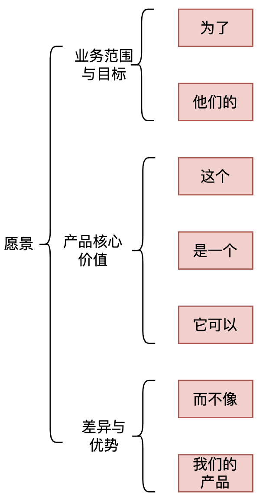
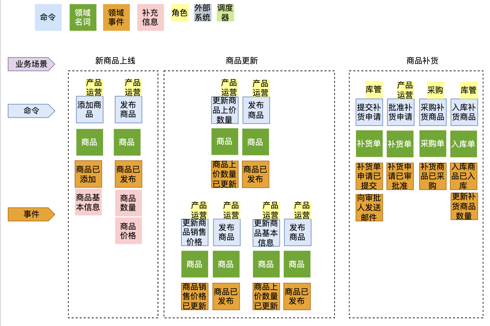

DDD的战略设计采用**事件风暴**的形式进行，事件风暴采用**工作坊**的方式，将**项目团队**和**领域专家**聚集在一起，通过**可视化**、**高互动**的方式输出战略设计的产出物，再根据战略设计设计的结果完成**领域模型**设计。

# 0. 事件风暴

事件风暴是建立领域模型的主要方法，它是一个**从发散到收敛的过程**。

事件风暴通常采用用例分析、场景分析和用户旅程分析，尽可能全面不遗漏地分解业务领域，并梳理领域对象之间的关系，这是一个**发散**的过程。

事件风暴过程会产生很多的实体、命令、事件等领域对象，我们将这些领域对象从不同的维度进行聚类，形成如聚合、限界上下文等边界，建立领域模型，这就是一个**收敛**的过程。

**事件风暴的总体过程如下：**

1. 领域专家和项目团队通过头脑风暴的形式罗列出所有的领域事件，整合之后形成最终的领域事件集合
2. 对每一个事件标出导致该事件的命令，再为每个事件标注出发起方的角色（如用户、定时器、其他系统等），整合之后形成最终的命令（如去重和伪命令）
3. 对事件进行分类整理，整理出聚合根、实体、限界上下文。

**根据事件风暴的结果，可以用三步来划定领域模型和微服务的边界。**

第一步：在事件风暴中梳理业务过程中的用户操作、事件以及外部依赖关系等，根据这些要素梳理出领域实体等**领域对象**。

第二步：根据领域实体之间的业务关联性，将业务紧密相关的实体进行组合形成**聚合**，同时确定聚合中的聚合根、值对象和实体。在这个图里，聚合之间的边界是**第一层边界**，它们在同一个微服务实例中运行，这个边界是**逻辑边界**，所以用虚线表示。

第三步：根据业务及语义边界等因素，将一个或者多个聚合划定在一个**限界上下文内，形成领域模型**。在这个图里，限界上下文之间的边界是**第二层边界**，这一层边界可能就是未来微服务的边界，不同限界上下文内的领域逻辑被隔离在不同的微服务实例中运行，物理上相互隔离，所以是**物理边界**，边界之间用实线来表示。

**领域事件架构（06):**

# 1. 参与者

- 领域专家：如对业务或问题域有深刻见解的主题专家、业务人员、需求分析人员、产品经理或者在这个领域有多年经验的开发人员里
-  DDD 专家
- 架构师
- 产品经理
- 项目经理
- 开发人员
- 测试人员

# 2. 准备材料

- 不同颜色的即时贴
- 水彩笔
- 蓝丁胶
- 磁扣
- 白板

# 3. 场地

- 完整的连续的墙面和足够大的空间（可以不需要桌子和椅子）

# 4. 事件风暴分析的关注点

重点关注如下业务的语言和行为：某些业务动作或行为（事件）是否会触发下一个业务动作，这个动作（事件）的输入和输出是什么？是谁（实体）发出的什么动作（命令），触发了这个动作（事件）…

我们可以从这些暗藏的词汇中，分析出领域模型中的事件、命令和实体等领域对象。

# 5. 事件风暴过程

事件风暴包括：

1. 统一产品愿景
2. 识别业务场景
3. 识别领域事件
4. 识别决策命令
5. 识别领域名词

## 5.1 统一产品愿景

**主要目的：**是对产品顶层价值的设计，使产品目标用户、核心价值、差异化竞争点等信息达成一致，明确业务方向和统一团队思想，避免产品偏离方向。

**参与角色：**领域专家、业务需求方、产品经理、项目经理和开发经理等。

**模板：**电梯演讲

对于<u>目标用户</u>

他们想<u>有什么样的需求</u>

这个<u>产品名称</u>

是一个<u>产品类型</u>

它可以<u>核心价值</u>

不同于<u>竞争对手</u>

这个产品<u>独特卖点</u>

**步骤：**

1. 参与者用统一的水笔和贴纸记录上图中每一个点的意见并贴在墙上
2. 将发散的意见统一为通用语言，建立产品愿景墙

**注意事项：**

1. 让参与者充分发表意见

## 5.2 识别业务场景

**主要目的：**从用户视角出发的，根据业务流程或用户旅程，采用用例和场景分析，探索领域中的**典型场景**，找出领域事件、实体和命令等领域对象，支撑领域建模。

**参与角色：**领域专家、产品经理、需求分析人员、架构师、项目经理、开发经理和测试经理等。

**模板：**用户旅程地图。

## 5.3 识别领域事件

**主要目的：**从用户视角出发的，根据业务流程或用户旅程，采用用例和场景分析，探索领域中的**典型场景**，找出领域事件、实体和命令等领域对象，支撑领域建模。

**输入：**用户旅程、用户故事、服务蓝图等

**参与角色：**领域专家、产品经理、需求分析人员、架构师、项目经理、开发经理和测试经理等。

**领域事件的三个原则：**

- 语法结构：名词已动词，如试卷已组装
- 系统留痕：状态或数据变动等（变动的领域名词是什么？）
- 统一语言：与业务描述一致

**步骤：**总体原则是“全员参与，迭代探索”

1. 根据领域事件的三原则找出所有的领域事件

2. 根据时间的先后顺序从左向右排序领域事件，

   2.1 同一时间发生的领域事件排成一列

   2.2 对于没有必然的时间前后关联的事件可以排在下方

**模板：**

**注意事项：**

- 参与者要尽可能地遍历所有业务细节，充分发表意见，不要遗漏业务要点。
- 不改变系统状态的命令和事件可以不必在事件风暴中体现。
- 关注事件引发的下一步操作。

## 5.4 识别决策命令

**定义：**命令是领域事件的触发动作，代表用户的意图、操作、决策。

**命令的发起者：**用户（角色）、外部系统、定时器、领域事件

**原则：**

- 语法结构：动宾结构
- 统一语言：与业务描述一致
- 完整性：一个命令至少要有一个发起者

**步骤：**总体原则是“全员参与，迭代优化”

1. 为每个事件找到相应的决策命令
2. 为每个命令确定相应的发起者
3. 从业务的角度检测命令、发起者和事件描述的一致性、正确性等

## 5.5 识别领域名词

**领域名词的定义：**领域名词是业务上下文中存在的领域概念，多数情况下对应到领域建模中的聚合。

**原则：**

- 快速收敛：在领域建模过程中进行集中抽象、整理和建模
- 识别差异化的业务概念：包括字段不同和业务概念本质的不同

**步骤：**

1. 识别领域名词：根据事件中数据或状态的变化确定领域名词（即事件到底导致了谁的变化，如商品还是订单）
2. 将同一个领域名词下的命令和事件组聚合在一起
3. 迭代优化

## 5.5 划分限界上下文

**定义：**某个场景或环境下的业务边界。

**作用：**

- 领域逻辑：确定了业务的边界、统一了业务边界内的语言，维护了业务在边界内的一致性和完整性，从而降低了系统的业务复杂度。
- 团队合作：确定了开发团队的工作和职责边界，建立了团队之间的合作模式，避免了团队沟通变得混乱，从而降低系统开发管理的复杂度。
- 技术风险：确定了系统架构的应用边界，保证了系统层和上下文层的隔离性，避免了相互的偶合，甚至是模型的侵入和污染，从而降低系统的技术复杂度。

**步骤：**总体原则“迭代优化”

1. v1.0版：采用“聚合分组法”等限界文划分方法得到v1.0版划分的限界上下文

   方法一：聚合分组法

   1. 领域名词汇聚：基于”**相关性**“（如业务的紧密程度和生命周期的相似性）进行领域名词的汇聚
   2. 领域名词拆分：领域名词的**职责**过大（用户角色过多）；领域名词的**生命周期**过长（领域名词经过多个业务流程）

   方法二：关建事件法

   1. 依据是否引发业务阶段转换的原则寻找关建事件，并用彩色胶袋进行标记
   2. 通过涌道标注并行流程，使用绝色胶代标注
   3. 挑选一位讲述者，从左到右讲述整个故事，在讲述过程中进行改进（事件的增删改，分割路径等）
   4. 基于之前的讨论与产出物得到限界上下文划分的结果

   方法三：四色建模法

   方法四：子域寻找法

2. v1.1版：根据“三因素调整”法划分v1.1版的限界上下文

   2.1 三因素调整法包括：业务变化速率、业务承载量；组织架构映射；高并发、可伸缩性、安全性、弹性等

3. v2.0版：根据战术建模调整限界上下文的划分

## 5.6 寻找上下文映射

**定义：**通过定义不同上下文之间的关系，创建一个所有模型上下文的全局视图。

**上下游：**

- 代表影响作用力，影响作用力与依赖方向相反，比如A是B的上游，从影响作用力的角度看A的变化会影响B，从依赖的角度看是B依赖A。
- 上游定义模型，下游适配模型

**价值：**

- 更直观的掌控全局，识别上下文依赖关系，为安排开发计划提供参考
- 逆向检查，上下文划分是否合理，如存在循环依赖、双向依赖、过长的依赖，就需要思考是否存在未澄清的问题

## 5.6 定义子域

**定义：**子域是一个企业中的业务范围，以及其中进行的活动，它代表一个单一的、有逻辑的领域模型。

**问题空间：**指业务所面临的挑战，如领域和子域属于的是问题空间。

**解决方案空间：**批解决业务面临的挑战，如限界上下文属于解决方案空间。

**子域与限界上下文的不同**：

- 子域属于问题空间，限界上下文属于解决方案空间
- 子域是一个宽泛笼统的对领域主次的划分，限界上下文是精准明确的对领域特性的划分
- 子域看重价值大小，限界上下文看重控制边界

**领域、子域和限界上下文的关系：**

- 一个领域对应1..n个子域
- 一个子域对应1..n个限界上下文

**识别子域的方法：**

方法一：角色分类法

依据业务活动的主要参与角色进行子域的识别

方法二：部门划分法

根据业务部门或工作组织的划分进行子域的识别

方法三：服务蓝图法

**如何判断核心域：**

- 可以借助需求分析阶段所产出的产品愿景（是指对产品未来前景和方向的一个调度概括描述）进行判断（比如与愿景中某个角色关联最多的子域可以是核心子域）。

## 5.7 领域建模

如何识别值对象？

- 问业务人员，“这个信息会不会变化”、“需不需要为这个信息保存快照”等等，从而间接地识别值对象。

# 参考资料

- https://sites.google.com/thoughtworks.com/event-storming-wiki/%E9%A6%96%E9%A1%B5
- 