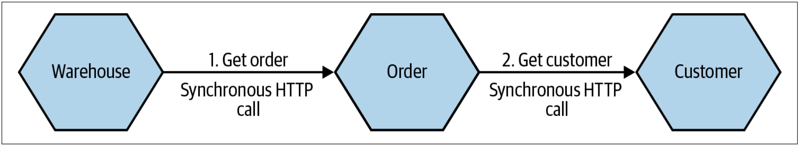

# 1. 微服务概念精粹

## 1.1 微服务的核心特点

**作用：**微服务的设计一定要围绕微服务的核心特点进行，否则都不是一个合理的微服务设计

**核心特点：**

- 独立部署：反模式包括共享数据库，分布式的大单体
- 面向业务领域建模：微服务首先是业务逻辑上的高内聚、低耦合，然后才是业务逻辑内的工程实现上的高内聚、低耦合（人人都是产品经理）

注：

- 独立部署是我们追求的目标，面向业务领域建模是独立部署的前提；
- 独立部署可以更快的发布产品，面向业务领域建模可以控制业务功能变更的范围；
- 独立部署是区别于单体应用的核心特点（单体应用指应用的部署单元）
- 偶合包括**实现偶合**和**部署偶合**
- 微服务为行为（*behaviro*）和状态（*state*）的组合，包含一个或多个用来管理领域聚合（*domain aggregates*）的状态机

## 1.2 微服务解决的问题和带来的新问题

> 根据业务目标（包含业务愿景）和组织的能力，结合微服务的优缺点来决策微服务架构是否适合。

**微服务解决的问题：**

- 提高团队治理能力：一个微服务通过对应7~12个人，通过赋予权利和责任，可以让小团队趋于自治，充分调动团队成员的积极性。 
- 缩短业务发布时间：这里主要指业务特性从开始开发到发布上线时间，此外这要依赖于服务的独立部署和发布单元
- 支持技术异构：根据业务特点为服务选择合适的技术栈或迁移到新的技术
- 合理的资源使用：可以精准的对具体的微服务进行缩容、扩容或取消，节省运营成本

注：

除了支持技术异构是微服务特有的优势，其他的优势实际上可以通过其他手段来达到，如在单体中为不同的团队开放不同模块的代码所有权也可以提高团队的治理能力；单体水平扩展+负载均衡也能达到合理利用资源的目的。

**微服务带来的新问题:**

- 增加了运维复杂度：从监控单体应用到监控分布式应用，问题定位变得更复杂
- 增加网络延迟：对于实时性要求高的系统并不适合使用微服务架构，如游戏
- 形成了数据孤岛：微服务并不擅长于解决数据聚合问题
- 如何拆分微服务：微服务拆分的不合理反而会适得其反，如不了解业务领域

## 1.3 接口设计原则

**指导原则：**

- 信息隐藏原则：不要暴露不必要的信息给外界
- 契约原则：接口作为契约，一旦确定，就要少变更或者保证变更的兼容性

注：暴露后再修改就要考虑兼容，反之则没有什么担忧

**设计方法：**

- 由外向内：根据上游服务或微服务自身所处领域的需求设计接口
- 由内向外：接口粒度越来越粗

注：这两个设计方法都是满足信息隐藏原则的

## 1.4 内聚与偶合

在微服务架构下，为了实现独立部署，我们更注重高内聚低耦合。

### 1.4.1 内聚

**定义**：把一同变化的代码放在一块。

**作用**：通过内聚减少变更的范围和成本（沟通成本、业务理解成本、环境搭建成本、发布成本等）

### 1.4.2 偶合

偶合是为了解决某一类问题而导致的。

#### 1.4.2.1 实现偶合

**定义**：服务A在实现时依赖了另一个服务B的内部实现，当服务B改变实现时，导致服务A也需要变更。比如服务A直接使用服务B的数据表。依赖公共的工具包实际上也是一种实现依赖。

**示例**：


**解决方案**：

- 使用Restful API接口作为契约，外部服务调用该接口
- 被依赖服务将数据发布到一个公共的仓库中，由依赖服务使用

#### 1.4.2.2 时间偶合

**定义**：为了完成某个业务功能，需要多个服务接口按时间顺序（或称先后顺序）进行级联访问。

**示例**：



**解决方案**：

- 在某一个位置统一编排服务间的接口调用，如BFF
- 采用异步事件的方式解偶服务间的依赖
- 采用缓存提高服务的可用性

#### 1.4.2.3 部署偶合

#### 1.4.2.4 领域偶合

# 2. 微服务迁移规划

> 不要为了微服务而选择微服务架构，**微服务不是我们的目标**。

## 2.1 理清四个问题

- 业务希望实现什么：包括业务愿景
- 是否考虑过除微服务以外的其他方案：调研过的方案对比结果是什么
- 技术团队面临的问题是什么
- 如何知道迁移过程是否有效：避免偏离业务目标

## 2.2 不要偏离核心目标

为了获得更多的变更收益，人们在定目标时，通常会考虑一个以上的目标，比如：

> 业务人员：我们需要让我们的系统支持更大的流量
>
> 开发甲：我们采用微服务吧，微服务是未来的方向，云原生技术也为微服务提供了相应的解决方案
>
> 开发乙：如果采用微服务，我们可以配置全功能的团队，这样团队就可以往自治方向发展
>
> 开发丙：我们还可以切换到新的技术栈，这样可以提升开发效率和团队的技术能力
>
> 开发丁：使用docker+k8s部署，支持服务的自动扩容和综容

为了支持更大的流量，我们额外设定了多个目标：

- 配置全功能团队，提升团队的自治力
- 引入新的技术和部署方式等

过多的导致的问题包括：

- 更长的前置时间：如在开发前需要考虑更多的事项和调研更多的内容
- 短时间内无法看到收益，影响团队士气
- 导致过度复杂的方案：如单体水平扩展可以应对流量增加，却无法引入新的技术

在多目标的决策过程中，需要区分**核心目标和间接收益**。核心目标作为第一优先级实现，如果在实现核心目标的过程中能够在可接受的成本内兼顾间接收益，则更好，如果无法兼顾，则将间接收益后移。尤其当间接收益阻碍核心目标的实现时，更需要后移或放弃间接收益。

## 2.3 微服务迁移的原则

**原则**：

- 小步增量迁移，及时发布（最好能发布到生产环境，这样能更早的暴露问题）
- 迁移过程中优先解偶，先简单后复杂
- 补充测试，保证迁移后功能的正确性

**步骤（分而治之的思想）：**

- 将待拆分系统分解成很多小的拆分步骤
- 每个拆分步骤都是可验证的
- 第个拆分步骤完成后及时发布
- 发现问题后，及时学习总结，调整策略，避免后续发生相同的问题

在实施拆分步骤时，建议拆分时先简单后复杂，这样做有以下几个好处：

- 可以及时的看到拆分的成果，鼓舞团队士气，
- 发生问题的影响面小，易修改
- 及早暴露出一些在设计和评估时未考虑到的问题

## 2.4 当不知如何决策时

当做决策的时候，我们经常会在多个方案之间徘徊，反复的分析每个方案的优缺点，希望通过对比来选择一个最合理的方案。然而，最终的结果可能事与愿违，此时我们又会想，假如我们选择了另一个方案是不是就不会有这些问题了。

**我们首先必须承认，在软件的开发开发、优化、变更过程中不可避免的会发生错误，我们应该要拥抱错误。通过在错误中不断的总结学习，我们才能更好的避免错误**。

当不知道如何决策时，我们应该**控制决策回退的成本**。


- 从可逆决策过度到不可逆决策时，决策回退的成本是在增加的
- 在成本增加的方向上做出决策时，需要考虑的更慎重、投入更多的人等
- 在越靠近可逆决策一端，就越可以由直接面对问题的人做出决策

如果依然无法做出决策，通常的做法是在影响最小的地方试错。

## 2.5 如何合理的拆分微服务

### 2.5.1 正向拆分

采用DDD的方法，利用DDD的工作坊进行战略和战术建模，找到聚合根，划分限界上下文，通过DDD的四层架构将一个或多个限界上下文实现为微服务。

那如何确定限界上下文的优先级呢？

DDD的传统作法是将限界上下文划分成子域，子域又分成通用域、核心域和支撑域，从业务价值出发我们应该将资源优先投入到核心域上。

但是，在从一个已有的系统向微服务迁移的过程中，我们需要考虑的更多，包括：

- 更早的获得方法有效性的反馈
- 越早的取得进展，提升团队土气
- 迁移的目标

因此，传统的DDD作法并不适合。为了解决该问题，我们建议采用“**难易度-价值四项限法**”，比如对于一个2C的销售订单场景：


如果我们想应对高峰时期的客户流量，其“难易度-价值四项限”的画法可能是：


因此，我们可能最先迁移出的服务是销售上下文。

然而，当真正的开始工作时，我们可能会遇到很多未考虑到的问题，这时候需要回过头来看我们在开始时制定的策略和方案，对先前的策略和方案进行调整和优化。

### 2.5.2 逆向拆分？

UML+数据表

## 2.6 组织团队

为了能够更好的向微服务迁移，我们需要重新组织开发团队，可以参考[如何组织微服务开发团队](./如何组织微服务开发团队.md)。在这篇文章中我们强掉的更多的是团队中应该包括的角色，而忽略了团队成员的能力。接下来我们说一说如何改善团队的技能。

为了改善团队的技能，我们需要了解Team的整体技能现状和Team对各项技能的期望，评估个人的技能现状和个人的技术发展期望，从中可以分析出团队整体技能的差距以及团队个人的发展是否可以弥补团队整体技能的差距，评估结果以雷达图的方式来展现。


从团队技能雷达中，可以看到当前团队的技能需求和技能差距。


从个人的技能雷达图中可以看出个人技能的发展方向。

在输出技能雷达时，需要根据团队的业务需求，确定合理明确的指标，比如：

- 0：对应级别为听说，意味着缺少使用经验，计划学习
- 1：对应级别为了解，意味着了解一点原理，有使用经验
- 2：对应级别为熟练，意味着有丰富的使用经验，能够分辨类似技术的优劣，清楚原理，灵活运用
- 3：对应级别为精通，意味着有丰富的使用经验，可以深度优化

个人技能雷达的输出，往往是匿名的，团队技能雷达的输出通常是基于团队关键角色对团队成员技能的了解，或是基于个人输出的技能雷达。

结合这两种技能雷达，当团队需要的技能无法在团队内解决，或是团队成员技能的成长速度无法匹配上团队的诉求时，可以通过引入新人的的方式来解决，同时引入的新人可以作为团队内部专家来帮助其他人快速成长。同时为了加快团队成员的技能成长和知识扩散，团队内部可以多做一些内部分享或是请一些外部专家做一些技术分享等等。

## 2.7 评估迁移过程是否有效

根据微服务迁移的目标选择合适的评估方式。

- **定期检查**

| 检查内容                           | 说明                                                         |
| ---------------------------------- | ------------------------------------------------------------ |
| 重新陈述我们期望迁移到微服务的目标 | 如果公司业务方向变了，那么我们的前进方向将不再有意义，那就停下来吧 |
| 查看所有的现有量化指标             | 确认我们是否取得进展                                         |
| 寻求定性反馈                       | 人们是否认为迁移仍然是有进展的                               |
| 决定今后要进行哪些更改             |                                                              |

- **定量指标**

定量指标通常包括如下：

| 指标       | 指标说明 |
| ---------- | -------- |
| Cycle Time |          |
| Lead Time  |          |
| 故障率     |          |
| 部署次数   |          |
| 性能指标   |          |

注意：不要过分强掉定量指标，否则可能会与微服务迁移的目标相背离。

- **定性指标**

定性指标更关注迁移过程中人的感受，如下：

| 指标                                             | 指标说明 |
| ------------------------------------------------ | -------- |
| 他们喜欢这个过程吗                               |          |
| 他们感到有授权了吗或是他们感到不知所措           |          |
| 他们是否获得了承担新职责或掌握新技能所需的支持？ |          |

# 3. 应用层迁移模式

## 3.1 目标

- 让用户对变化无感知
- 降低已有业务的影响
- 降低对其他开发人员的影响

## 3.2 绞杀者模式

>  **特点**：支持增量迁移（小步迁移），新旧系统可以并存，并支持快速回退。

### 3.2.1 实现步骤

- 确定现有系统中要迁移的部分
- 在新的微服务中实现此功能
- 在准备好新的实现之后，需要能够将请求从单体重新路由到新的微服务


### 3.2.2 两种应用方式

- 端到端应用模式

一次性全量迁移一个功能，适用于简单功能的迁移。


- 增量修改模式

适用于复杂功能的逐步迁移，新的服务与原服务之间依然会存在偶合，偶合点包括功能接口和数据库。


### 3.2.3 路由切换方式

通过在客户端和服务之间插入代理，并在代理上配置路由规则，以实现调用迁移的功能。配合健康检查机制，在新服务出现问题时可以自动切换到旧服务。


**适用场景**：代理适用于访问服务直接开放的接口，如前端直接调用的RESTFul接口。

**不适用的场景**：新服务开放的接口由原服务内部调用，则需要使用抽象分支模式解决。

## 3.3 抽象分支模式

适用于迁移系统底层的功能，其特点是：

- 支持以增量的方式修改代码库
- 够降低对同一代码库其他开发人员的影响
- 允许我们在不依赖源代码分支（如特性分支、迁移分支）的情况下逐步修改单体

### 3.3.1 实现步骤

1. **为要替换的功能创建一个抽象**

   

2. **使用抽象逐步替换现有客户端**


3. **创建抽象的新实现**

   

   此时抽象有两个实现，一个实现调用原有的通知服务，另一个实现调用新实现的通知服务。**两个实现中只有一个实现处理激活状态**。

4. **切换到新服务**

当旧的功能迁移完成后，可以切换到新服务。


可以借助功能开关实现动态切换新旧服务。

5. **清理**

当新服务完全能够替代旧的功能时，可以考虑清理旧服务上不再使用和多余的代码。清除的对象包括：旧的功能、不再使用的功能开关、抽象接口和抽象接口不再激活的实现。当然如果步骤1中创新的抽象比较简单，可以考虑保留。


### 3.3.2 智能抽象分支模式

通过增加一个检测层自动检测新服务的可用性，根据检测层的结果智能的使用旧的功能或新服务。**这种方式对有状态的服务会导致数据不一致，需要旧的功能和新服务共享同一个数据存储来解决**。


## 3.4 新老并行模式

**适用场景**：验证新服务功能的正确性。

**作用**：不仅可以验证新服务功能的正确性，还可以验证新服务的跨功能性需求。

### 3.4.1 新服务使用全量实现

**注意**：使用这种方式运行新老服务，需要仔细评估新服务对老服务和用户的影响。如果调用新服务对用户不产生影响（如不会重复发送邮件），或不会在旧系统中产生脏数据（如数据不会保存至旧的数据库中），则新服务中可以不使用测试替身技术。

**实现方法**：当使用并行运行时，我们不是调用新旧实现的其中之一，而是**同时调用二者**，以允许我们**比较其结果以确保它们是等效的**（手动或人工进行数据对账）。尽管调用了两种实现，但在任何给定的时间内，只有一个实现的结果是正确的。一般而言，在不断校验并相信我们的新实现之前，我们认为旧实现的结果是正确的。


### 3.4.2 新服务使用测试替身技术

如果同时调用新旧服务会产生副作用（如向用户发送了两次邮件），为了避免这种问题需要对新服务采用测试替身技术。使用测试替身技术可以验证相关功能是否调用、输入参数和输出结果的正确性。


使用这种方式的不足是无法端到端测试新服务功能的正确性，因此依然会有一些遗漏的测试点。并且使用测试替身会增加测试新服务的复杂性，如在新服务中使用测试替身替换部分功能，待新服务通过验证后还需要移除这些测试替身。因此，使用测试替身时需要慎重考虑。

### 3.4.3 灰度发布

这种方法可以让小部分人先体验新服务，这样可以降低新服务出现问题时的影响范围。

## 3.5 装饰协作模式

**适用场景：**服务之间的编排（比如BFF），比如单体内部发生的事情来触发某些行为，但又无法或不希望修改单体。


<center>需要根据订单的价格为用户创建积分</center>

**挑战**：

- 避免服务之间的循环依赖
- 调用新服务的请求中最好能够带上所有需要的信息（这可能导致需要修改旧的服务，与我们使用该模式时的初衷相违背），而无需新服务调用旧服务获得数据

## 3.6 CDC(Capture Data Change)

> CDC: 捕获数据变更

**适用场景**：新服务需要对单体数据的变化做出反应，又无法使用绞杀者模式或装饰器模式在系统范围内拦截该数据变化，同时又无法修改底层的代码库。

**挑战**：

- 数据变更要求CDC相关的配置也要同步变更

### 3.6.1 数据库触发器


**挑战**：

- 触发器越多，就越难理解系统的实际工作方式
- 可能无法调用WEB服务或自定义Java代码

### 3.6.2 轮训事务日志


**挑战**：

- 只有已提交的事务才会记录在事务日志中，可能对一些场景不适用
- 支持的日志格式


## 3.x 可能遇到的问题

### 3.x.1 迁移过程中对现有功能进行修改或修复Bug

迁移过程中，如果只对迁移出来的新服务进行修改，在回滚新服务时，会导致功能丢失或Bug再现，因此需要选择合适的方式进行功能修改或Bug修复。

**如果想要在迁移完成之前修改功能，那么就必须接受回滚会更加困难这一事实**。

**原则上，迁移功能时，尽量消除对待迁移功能的任何更改——尽可能把新功能或Bug修复推迟到迁移完成之后。否则，可能会降低系统的可回滚能力**。但是一旦作出这种选择，功能迁移的时间越长，业务则承担的压力就越大，而这种选择也越难实施。

为了解决这两种选择间的冲突，我们可以控制每次迁移的规模。**每次迁移的规模越小，在迁移完成之前修改待迁移功能的压力就越小**。

这里边给出几种建议：

- 对于已迁移完的功能，可以直接进行修改
- 对于将要迁移的功能，如果需要进行修改，可以在修改之后再迁移
- 对于正在迁移的功能，原则上迁移过程中不进行功能变更。如果是紧急问题需要修复，根据修改的复杂性，可以在新旧服务同时进行修改，或是回滚新服务到上一个版本，问题修复后再重新迁移。

# 4. 数据库迁移模式

## 4.1 为什么要迁移数据库

在单体世界中，实际上是多个服务共享同一个数据库，这会带来以下问题:

- 无法决定共享和隐藏什么数据
- 不知道schema的哪些部分可以安全修改，因为不知道其他服务使用schema的哪一部分
- 不清楚谁“控制”数据，这意味着业务逻辑缺乏内聚
- 无法对不同的服务采用不同的数据库优化策略

共享数据库并不是毫无用处，在以下场景中可以考虑使用共享数据库：

- 当数据是只读的静态的数据时，这类数据结构是稳定的且很少发生变更，如邮政编码等
- 当一个服务将数据库作为明确的端点（*end-point*）而直接公开时，该端点是为处理多个使用者而设计和管理

但是与应用迁移相比，数据库迁移可能面临更多的问题和更高的复杂性，并且迁移的副作用可能比想想的更多。这主要是因为，Schema中表间的关联关系可能并不清晰、数据间的约束可能不易识别、不清楚谁来“控制”或使用表中的数据等等。因此，对于数据库迁移，我们可能很难直接开始进行迁移，而是先从**降低偶合**开始的。

对于数据库迁移，我们的原则是：**先降低服务对数据的直接依赖，再迁移数据库**。

## 4.2 降低服务对数据的直接依赖

### 4.2.1 视图

**使用场景**：多个服务使用一个数据源，通过视图降低服务对底层数据的偶合。视图可以限制数据对服务的可见性，从而隐藏服务不应该看到的信息。


**实现步骤**：

- 为视图创建一个schema
- 在新schema中创建View
- 客户端切换到新的schema上
- 保持视图不变，修改底层的数据表

**使用约束**：

- 数据库是否支持视图
- 视图是否支持写操作（如果服务需要写操作）
- 视图的性能（materialized view使用缓存来预先计算视图，但数据不是实时同步的）
- 公司是否允许使用视图

**谁来维护视图**：

底层schema的拥有者来维护该视图

**如何识别各个客户端对数据库的操作**：

可以给每个客户端分配独立的用户名和密码，通过日志查看用户对各个数据表的操作。

### 4.2.2 用服务封装数据库

**使用场景：**将数据库隐藏在服务之后，该服务作为数据库的一层薄薄的包装，从而将数据库依赖转变为服务依赖。


**与视图相比的优缺点**：

优点：

- 不必呈现可以映射到现有表结构的视图
- 可以在包装服务中编写代码，以对基础数据进行更复杂的投影
- 包装服务还可以通过API调用执行写操作
- 测试时可以很容易的使用测试替身
- API监控更容易

不足：

- 需要上游消费者做出改变，上游消费者必须从直接的数据库访问转移到API调用，且这种变更的成本比直接切换到视图的成本更高

### 4.2.3 将数据库开放为服务端口

**适用场景**：客户端只需要一个用于查询的数据库，将数据库开放为服务端口可以将公开的数据库与服务边界内使用的数据库分开，尤其适用于报表功能。


**实现要点**：

- 开放的数据库是只读的
- 根据业务需求选择内部数据库与开放数据库间的数据同步方案，CDC方案延迟最低

**优点：**

- 开放数据库可以根据业务需求使用不同于内部数据库的不同数据库
- 与视图相比具有更强的灵活性

**不足：**

- 需要实现数据映射器
- 与视图相比需要更多的工作量，这些工作量可能都需要编码实现
- 开放数据库与内部数据库间存在一定的数据延迟，需要根据业务需求采用相应的技术降低延迟，或者告诉客户端外部数据库的最新更新时间是合适的

## 4.3 迁移数据库

### 4.3.1 面临的问题

- 破坏事务的一致性
- 破坏数据库外键
- 服务迁移后的数据迁移
- 服务迁移过程中的数据同步
- 异构数据库的迁移

### 4.3.2 服务迁移过程中的数据同步

像如绞杀者模式之类的方法的好处之一是：当我们切换到新服务时，如果有问题，我们可以再切换回旧的服务。但是，当数据需要在单体和新服务之间保持同步时，就会出现问题。


不同的解决方案的技术复杂性和实现成本不同，在选择解决方案前需要确认一个问题：**数据之间所需要的数据一致性的程度**。

解决方案包括：

- 在未确认迁移成功时，新服务使用和单体相同的数据库，直到确认迁移成功后再进行数据迁移
- 如果确认需要同时迁移功能和数据，可以使用批量复制的方式将数据复制到新服务（新旧服务的数据会出现不一致）
- 如果使用私有数据库的新服务出现了问题，现在需要回退到旧服务，则需要使用脚本将新服务中新增的数据复制到旧服务中
- 可以考虑将旧服务的数据库和新服务的数据库设置为互为主备，让数据库解决数据一致性问题，但需要注意同步延时和由于异常导致的同步终止
- 在代码层面进行双写（同时写新旧服务），结合特性开关在Infrastructure层实现，可以控制是否写旧服务。该种解决方案需要使用分布式ID，否则可能由于新旧服务的数据ID不同导致双写失败，并且新服务只能使用一个数据库作为数据源。--- 这是一种迫不得已的方法

### 4.3.3 最终一致性的数据同步方法

### 4.3.4 事务一致性的数据同步方法

## 2.1 微服务迁移的关注点

**应该关注什么：**

- 可以处理多少个微服务：决定我们微服务迁移的策略
- 如何划分微服务边界：防止微服务让事情变得一团糟
- 组织架构的调整：减少交付冲突和沟通成本

**不应该关注什么:**

- 技术选型：这是实现层面，而不是决策层面

注：

- 为什么不关注基础设施？因为服务上云的趋势，云会为我们提供相应的能力；
- 为什么不关注团队的能力？可以处理多少个微服务中需要考虑团队的能力，如果服务上云，对团队的能力要求其实就是学习云的操作

# 5. 工具

## 5.1 Scientist4J

地址：[Scientist4J](https://github.com/rawls238/Scientist4J)

支持的语言：Python，Java， C++， NodeJS, Go, Kotlin

使用方式：

```java
// 方式1
Experiment<Integer> e = new Experiment("foo");
e.runAsync(this::controlFunction, this::candidateFunction);

//方式2
Experiment<Integer> e = new Experiment("foo");
e.runAsyncCandidateOnly(this::controlFunction, this::candidateFunction);
```

功能：

- It decides whether or not to run the candidate function
- Measures the durations of all behaviors
- Compares the result of the two
- Swallows (but records) any exceptions raised by the candidate
- Publishes all this information（Metric).

Metrics:

- duration of default (control) behavior in ns
- duration of candidate behavior in ns
- counter of total number of users going through the codepath
- counter of number of mismatches
- counter of candidate exceptions

# 参考资料

1. https://wangwei1237.github.io/monolith-to-microservices/docs/What_Are_Microservices.html