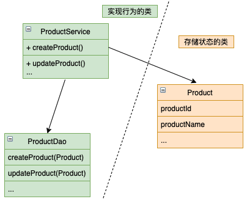

## 1. 事务脚本模式

将业务逻辑组织为面向过程的事务脚本的集合，每种类型的请求都有一个脚本，是一种面向过程的代码组织方式。

**特点：**

- 前端的每个操作在后端都有一个对应的函数
- 一组类实现行为，另一组类负责存储状态
- 负责存储状态的类中几乎没有行为
- 通常在service中实现事务脚本

**优点：**

- 开发简单，上手快

**缺点：**

-  业务逻辑分散
- 代码缺乏可复用性

**举例：**

## 2. 业务能力

业务能力是一个来自于业务架构建模的述语。

**业务能力是指一些能够为公司（或组织）产生价值的商业活动**。特定业务的业务能力取决于这个业务的类型。如保险公司的业务能力通常包括承保、理赔管理、账务和合规等。在线商店的业务能力包括订单管理、库存管理和发货等。

**特点：**

- 业务能力通常是稳定的
- 业务能力的实现方式通常是随着时间变化的。

