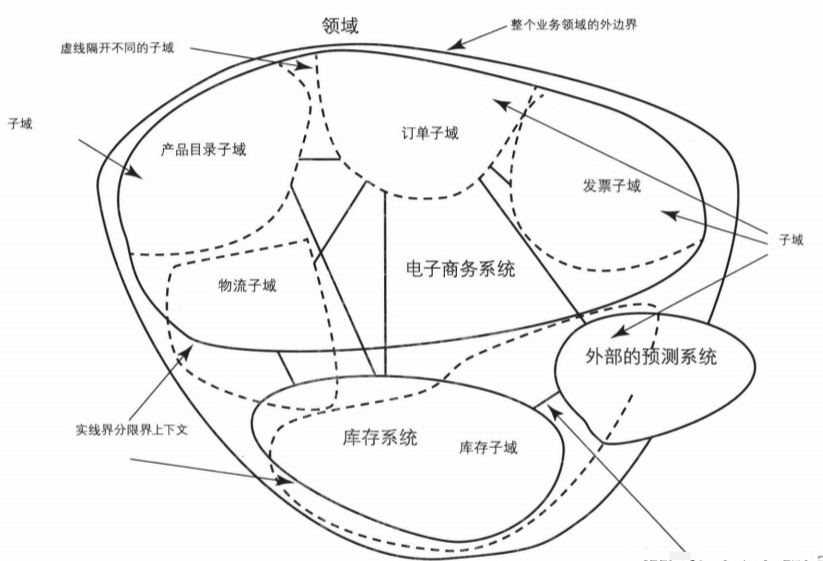
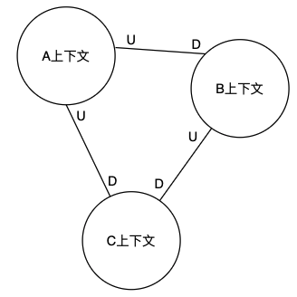
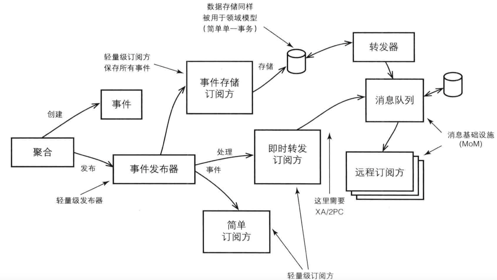

# 0. DDD适用的场景

DDD是一种**针对大型复杂系统的领域建模与分析方法**，它是一套方法论，建立了以领域为核心驱动力的设计体系。

# 领域专家

领域专家并不是一个职位，他可以是精通业务的任何人。他们可能了解更多的关于业务领域的背景知识，他们可能是软件产品的设计者，甚至可能是销售员。

# 领域模型

领域模型是关于某个特定业务领域的软件模型。通常，领域模型通过对象模型来实现，这些对象同时包含了数据和行为，并且准确表达了业务含义。

领域模型把通用语言表达成软件模型。

# 1. 战略设计

**战略设计，通过建立限界上下文、统一语言和上下文映射对业务进行高层次的抽象和归类。**

战略设计关注复杂业务的分解，通过将复杂业务分解为一个个小的子域以及相互之间的关联关系，可以指导团队协作和后续的战术设计。

战略设计的产出一般包括限界上下文、统一语言、问题域的划分（核心域、支撑域和能用域）、上下文映射。

## 1.1 领域(Domain)

**领域即是一个组织所做的事情以及其中所包含的一切，即业务知识**。业务有一些内在规则，存在专业性，比如财务、CRM、OA、电商等不同领域的业务规则不同。计算机只是业务规则的自动化。



## 1.2 子域(Sub Domain)

**子域是领域的一部分**。

在DDD中，为了降低业务理解的复杂度，一个领域被划分为若干子域，每个子域都有一个清晰的限界上下文，领域模型在限界上下文中完成开发。在开发一个领域模型时，我们关注的通常只是这个业务系统的某个方面。

## 1.3 通用语言(Ubiquitous language)

**通用语言是团队自己创建的公用语言，其中包括领域专家、开发、业务分析员等**。团队成员使用通用语言进行交流。通用语言会随着时间推移而不断的演化。

**限界上下文与通用语言存在一对一的关系**。

## 1.4 核心域(Core Domain)

**核心域是指领域中最核心的部分，通常对应企业的核心业务，也是业务成功的主要促成因素**。

从战略层面上讲，应该给核心域最高的优先级、最资深的领域专家和最优秀的开发团队。

## 1.5 支撑域（Support Domain）

**支撑域是一种特殊的子域，是指为了实现核心业务而不得不开发的业务所对应的相关知识的集合**。支撑域对应着业务的某些重要方面，类似于定制开发，但却不是核心。对它的投入无论如何也达不到与核心域相同的程度，甚至可以考虑使用外包的方式实现此类限界上下文，

例如，活动平台业务属于电商的支撑域，因为该业务对于电商企业并不是必需的，其存在的意义仅在于放大利润。

## 1.6 通用域（General Domain）

**通用域是另一种特殊的子域，对应的是业界已经有成熟方案的业务**。

通用域可以看做一种特殊的支撑域，可以使用标准部件来实现，短信通知、邮件等领域问题。

## 1.7 限界上下文

**限界上下文可以看成是整个应用程序之内的一个概念性边界。在这个边界之内的每种领域术语、词组或句子--即通用语言，都有确定的上下文含义。在边界之外，这些述语可能表示不同的意思**。

在 DDD 实践中领域模型会被限定在限界上下文当中。

限界上下文强调概念的一致性。虽然传统的方法学已经在追求概念的一致性，但是忽略了系统的庞大性，不论系统多庞大，在系统任何位置同一概念通用。DDD 不追求全局的一致性，而是将系统拆成多块，在相同的上下文中实现概念一致性。

识别上下文可以从概念的二义性着手，比如商品的概念在物流、交易、支付含义完全不一样，但具有不同内涵和外延，实际上他们处在不同上下文。

限界上下文主要用来封装通用语言和领域对象，但同时它也包含了那些为领域模型提供交互手段和辅助功能的内容，如应用服务、数据库Schema。

限界上下文可以用于微服务划分、避免模型的不正确复用带来的问题。

## 1.8 问题空间(Problem Space)

**业务所面临的挑战**。

问题空间是领域的一部分，对问题空间的评估应该同时考虑已有子域和额外所需子域。

## 1.9 解决方案空间(Solution Space)

**解决业务所面临的挑战的解决方案集合**。

解决方案空间包括一个或多个限界上下文，即一组特定的软件模型。

## 1.10 上下文映射(Context Map)

**上下文映射表示不同限界上下文在解决方案空间中是如何通过集成相互关联的。**



其中U代表upstream，D代表downstream，下游依赖上游。

在上下文映射中需要特别注意**循环依赖、双向依赖和过长的依赖**，如果出现这几种依赖关系，需要思考限界上下文分解的是否合理。

# 2. 战术设计

## 2.1 实体

**实体是具有唯一身份标识的对象。**

实体的特征：

- 具有唯一身份标识并且在实体的生命周期内保持不变
- 可变性
- 具有相同身份标识的两个实体是相同的对象

```java
//实体
public class Product extends Entity {
  //实体的身份标识为一个值对象
  private ProductId productId;
  ...
    
  public Product(ProductId productId) {
    this.setProductId(productId);
  }
    
  public Date creationDate() {
    this.productId().creationDate();
  }
  
  //省略setter和getter
}

//值对像
public class ProductId extends ValueObject{
  private static final SimpleDateFormat DEFAULT_DATE_FORMATTER = new SimpleDateFormat("yyyyMMdd");;
  private String productId;
  
  public ProductId(UUID uuid) {
    this.productId = "APM-P-" + DEFAULT_DATE_FORMATTER.format(new Date()) + "-" + uuid.substring(0,10)
  }
  
  public Date creationDate() {
    return DEFAULT_DATE_FORMATTER.parse(this.productId.split("-")[2]);
  }
}

//获取ProductId
public interface ProductRepository {
  default ProductId nextId() {
    return new ProductId(UUID.randomUUID());
  }
```

## 2.2 值对象

**值对象表示属性集合的对象。**

值对象的特点：

- 一般没有身份标识
- 不可变（只能整体更新，实际上是替换成了一个新的值对象实例）
- 具有相同属性值的两个值对象可以互换使用
- 没有实体复杂

## 2.3 领域服务

领域服务表示一个无状态的操作，它用于实现特定于某个领域的任务。

**领域服务主要用于如下场景：**

- 执行一个显著的业务操作过程（如计算金额、审计等）
- 对领域对象进行转换
- 以多个领域对象作为输入进行计算，输出计算结果

在实现领域服务时，如果一个领域服务只有一种实现且并非一个技术上的实现（如与其他服务或基础设施进行集成等），通常没有必要为领域服务声明一个接口。

## 2.4 领域事件

领域事件表示领域中所发生的事情，每个事件用**领域对象**表示。

**领域事件的产生、存储、转发和订阅：**



**领域事件的适用场景：**

- 通过事件维护数据的最终一致性
- 将复杂的或集中处理的业务逻辑拆分成许多粒度较小的处理单元

领域事件建模：

- 领域事件一般用于表示一个已经执行成功的操作，通过由命令操作产生
- 领域事件代表已经发生的事情，即命名上采用过去式，一般的全名范式为“聚合+操作的过去式”
- 领域事件对象通常被设计成不可变的，通过构造函数进行全状态的初始化

## 2.5 模块

模块表示一个命名的容器，用于存放领域中**内聚**在一起的类。模块应该包含一级具有高内聚的概念集合，将类放在不同模块中的目的在于达到松耦合性。

**设计模块的简单原则：**

- 模块应该和领域概念保持一致，并根据通用语言来命名模块
- 设计松耦合的模块
- 同层模块应该杜绝**循环依赖**
- 父子模块之间可以放松原则
- 模块应该随着模型的变化而变化，并不是一层不变的
- **不要机械的根据通用的组件类型和模式来创建模块**，如service
- 对于内聚性不强或者没有内聚性的领域对象来说，应该将它们划分到不同的模块中

**示例：**

- com.thoughtworks(组织顶级域名).agilepm(限界上下文).domain(分层).model(模块).team(具体模块)

- com.thoughtworks.agilepm.domain.model.project
- com.thoughtworks.agilepm.domain.model.product
- com.thoughtworks.agilepm.domain.model.product.backlogitem
- com.thoughtworks.agilepm.domain.model.product.release
- com.thoughtworks.agilepm.domain.model.product.sprintt

## 2.6 聚合

聚合由**多个**领域对象（实体和值对象）在**一致性边界之内**组成。定义一个聚合通常包括两部分：

- 一个聚合根实体(Aggregate Root)，一般用聚合根代表聚合
- 聚合的完整性规则

**聚合的完整性规则通常包括：**

- **在一致性边界内业务的不变条件**，如订单的价格与订单项
- 所有的代码只能通过聚合根访问系统的 Entity，而不能随便的操作任一的 Entity
- 每个**事务**范围只能只能更新一个聚合根及它所关联的 Entity 状态

**聚合的设计原则：**

- 设计小的聚合：使用聚合根（一个Entity）来表示聚合，其只包含一些基本数据类型属性和值对象属性（值对象可以和聚合根存储在一张表中），只要能够满足业务不变条件即可，不建议一开始就设计成大聚合
- 聚合间的引用：通过唯一标识引用其他聚合，被引用的聚合不在一致性边界内（即在同一个事务中进行修改）
- 在一致性边界之外采用最终一致性：如果一个事务中需要修改多个聚合，那么可以借助事件(Event)实现最终一致性
- 资源库和服务的使用：通常在Application service层中使用资源库和服务
- 估算聚合成本：从一个命令需要聚合加载的对象的数量（或平均数量）来考虑聚合的成本
- 考虑用例场景：从可扩展性、并发性角度思考用例场景

# 3. 工厂

# 4. 存储库

# 5. 服务

# 3.原则

- 尽量避免在聚合中使用资源库
- 只与领域相关的信息不能泄露到客户端中
- 在单个事务中，只允许对一个聚合实例进行修改，由此产生的其他改变必须在单独的事务中完成
- 聚合之间的引用只能通过实体的ID

