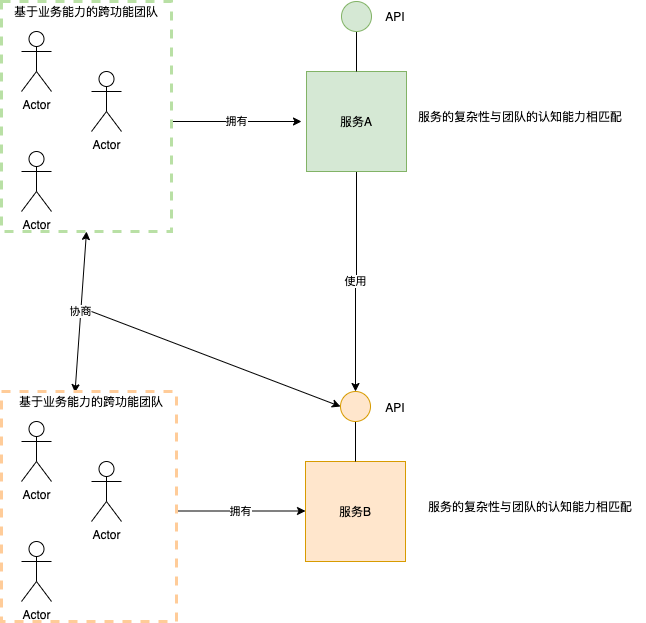
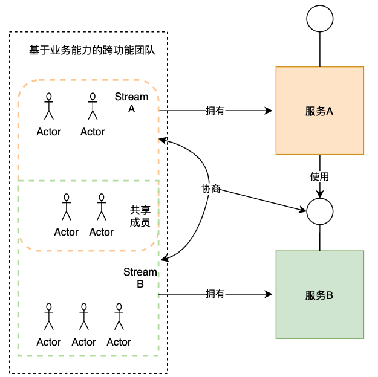

一个高效的开发组织通常由多个团队组成，每个团队都是**长期存在的、规模较小、松散耦合、自治和跨职能**的。根据[康威定律](https://en.wikipedia.org/wiki/Conway's_law)（架构反映了构建它的组织的沟通结构），由松散耦合团队组成的组织需要松散耦合的架构。

**微服务架构**就是这样一种**松散耦合的架构**。它是一种将应用程序构建为一组松散耦合的服务的应用程序架构。可以通过多种方式识别服务，并围绕业务功能组织服务。 

服务和团队之间的关系是什么？

一种方法是**共享所有权模型**，团队根据需要处理每个服务，如团队可能需要同时修改多个服务的代码来实现某个功能。这种方法的优点是使团队与用户体验保持一致；缺点是沟通成本高并且由于缺乏代码所有权会增加代码质量差的风险。

> 我所在的开发团队就曾经采用了这种开发模型，结果导致：
>
> - 一个微服务的代码中，有多种代码风格，代码存在大量的坏味道，如代码重复
> - 开发对其修改的微服务的代码架构、业务等并不都是非常清楚
> - Code Review时团队成员无法对一个微服务的代码架构、开发规范等形成统一认识
> - 站会时间长
> - 团队成员对代码进行优化和重构的意愿比较低

另一种方法是**服务所有权模型**。一个自治和跨职能的团队负责一个或多个服务的开发、测试、运维和部署。这种方法的优点是团队职责清晰，沟通效率高；缺点是在和其他服务有关联的边界处需要与其他团队协商API和对齐开发计划。

理想情况下，一个团队应该只拥有一项服务的所有权。过多的服务会增加团队业务和管理的复杂性，并且随着各个服务复杂性和规模的扩大，势必导致团队规模的扩大，团队规模扩大到一定程度时就需要将团队拆分成更小的团队，不利于团队的稳定。

那么，如何组合一个合适的微服务开发团队呢？

- 由跨职能的团队组成，团队规模很小，如8-12人，包含至少一位QA和一位BA
- 有明确的职责：开发和运维一个或多个业务相关联的服务
- 团队应该是自治的松散耦合的
- **服务的复杂性与团队的认知能力相匹配**（如不能为全是新人的团队分配过于复杂的服务）

这种模式的优点：

- 使每个团队都能够自主工作，并与其他团队进行最少的协调
- 使团队松散耦合
- 由于长期的代码所有权，提高了代码质量

这种模式的缺点：

- 团队不一定与用户的体验保持一致
- 实现跨服务的功能更加复杂，需要多团队协作

如果一个团队负责多个服务，在团队内部还可以按stream的方式划分团队，这时：

- 每一个stream负责一个服务的开发
- 团队中的核心开发、BA和QA在多个stream中共享
- 服务的复杂度要与stream内的团队成员认知能力相匹配

