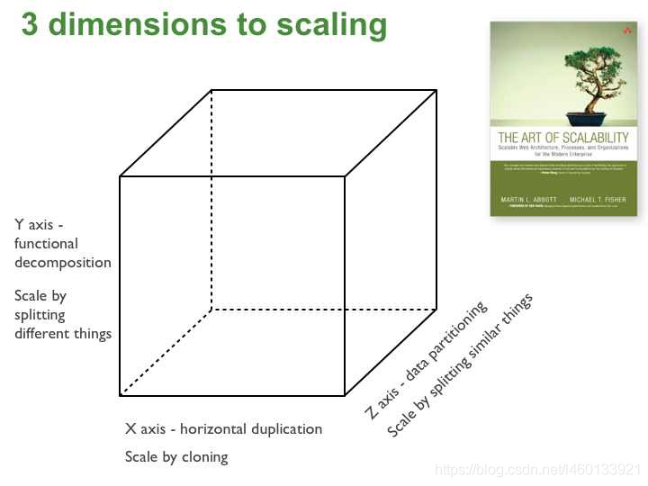
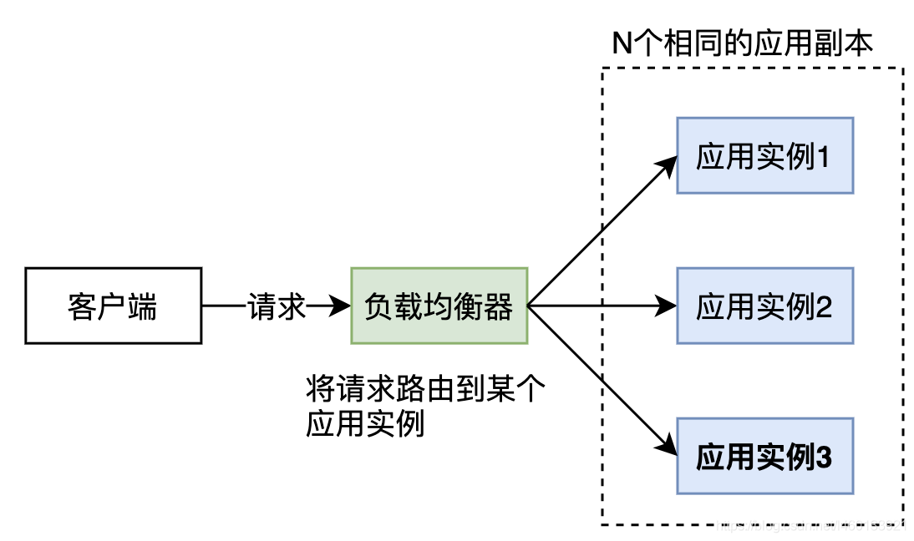
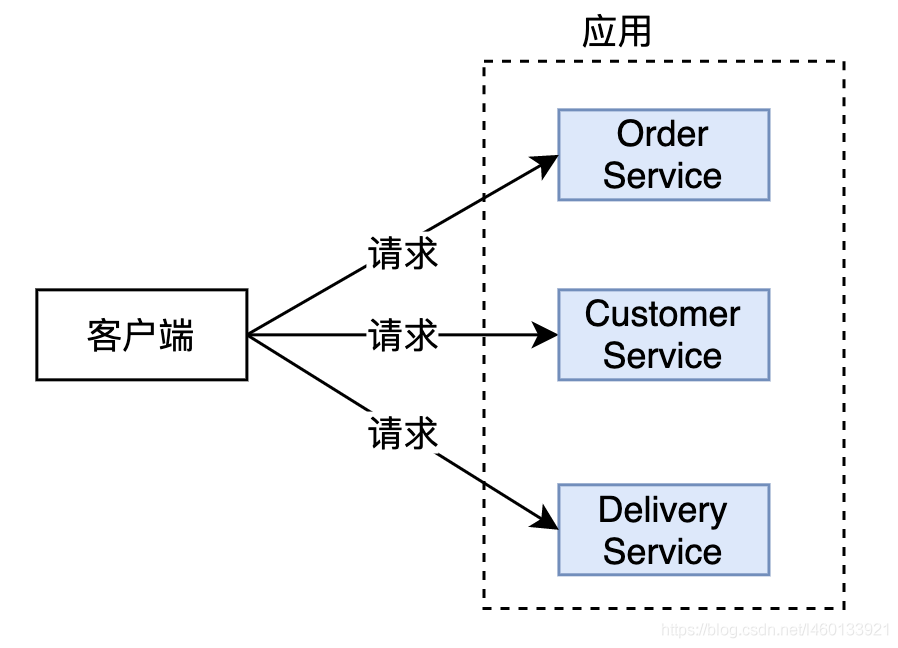
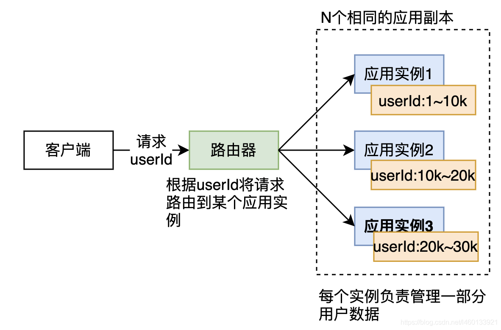

在讲软件架构时，我们主要关注的是软件的**非功能性需求**，比如可扩展性、易维护性、可测试性、可用性等。在进行非功能性需求设计时，常使用的方法包括服务拆分、借助负载均衡运行多个相同的应用副本和分库分表等。

本篇主要介绍来自于《The Art of Scalability》这本书的可扩展立方体模型(scale cube)。在该模型中通过X轴、Y轴和Z轴三种不同的方法来扩展应用，每种方法可以解决不同的问题，并具有不同的优缺点。在实际应用时，设计人员可以根据业务需求组合不同的扩展方法。比如常用的方法是：使用Y轴扩展进行微服务拆分，再使用X轴或Z轴扩展对应用进行扩展。

# 1. 扩展立文体模型
扩展立文体模型如下：

# 2. X轴扩展
**X 轴扩展是借助负载均衡器运行多个相同的应用程序副本**。如果有 N 个副本，则每个副本处理 1/N 的负载。这是一种简单、常用的扩展应用程序的方法。示例如下：

优点：

- 提高系统吞吐量
- 提高系统可用性

缺点：

- 缓存需要更多的内存，因为每一个实例都可以访问所有的数据
- 没有解决由于应用的持续增长导致的应用复杂性的增加

实际上X轴扩展并没有解决在[第1篇：单体架构与微服务架构的对比](https://blog.csdn.net/l460133921/article/details/119304138?spm=1001.2014.3001.5501)中介绍的有关单体架构的缺点。

# 3. Y轴扩展
 X 轴和 Z 轴的扩展方法都是运行多个相同的应用程序的副本，但**Y 轴的扩展方法是将应用程序拆分为多个不同的服务，每个服务负责一个或多个相关的功能**。示例如下：
 

Y轴的扩展方法能够解决应用体量增加带来的应用复杂性增加的问题，其优缺点可以参考[第1篇：单体架构与微服务架构的对比](https://blog.csdn.net/l460133921/article/details/119304138?spm=1001.2014.3001.5501)中介绍的有关微服务架构的优缺点。

# 4. Z轴扩展
**Z 轴扩展方法同样是运行相同应用程序的多个副本，与 X 轴扩展方法的不同点是：每个应用实例只负责数据的一个子集**。应用通常借助某个组件将用户请求根据请求中的某个属性（如用户ID）路由到某个具体的应用实例。示例如下：

优点：

- 每个应用实例只处理数据的一个子集
- 提高了缓存利用率并减少了内存使用和 I/O 流量
- Z 轴扩展改善了故障隔离，因为故障只会使部分数据无法访问。

缺点：

-  增加了应用程序的复杂性
- 实现和设计数据分区方案
- 没有解决由于应用的持续增长导致的应用复杂性的增加

在使用Z轴扩展时常用的路由属性包括：

- 访问实体的主键
- 客户类型，如应用程序可以通过将请求路由到具有更大容量的不同服务器集，为付费客户提供比免费客户更高的 SLA

Z 轴扩展主要用于扩展数据库，根据每条记录的属性在一组服务器上进行数据分区（也称为分片）。在应用于扩展数据库时，通过将一台或多台服务器部署为副本/从服务器，可以将 X 轴扩展方法应用于每个数据分区。

当然，Z 轴扩展也可应用于扩展应用，如搜索服务由多个数据分区组成。路由器将每个内容项发送到适当的数据分区，在那里对其进行索引和存储，查询聚合器将每个查询发送到所有数据分区，并组合每个数据分区的查询结果。
