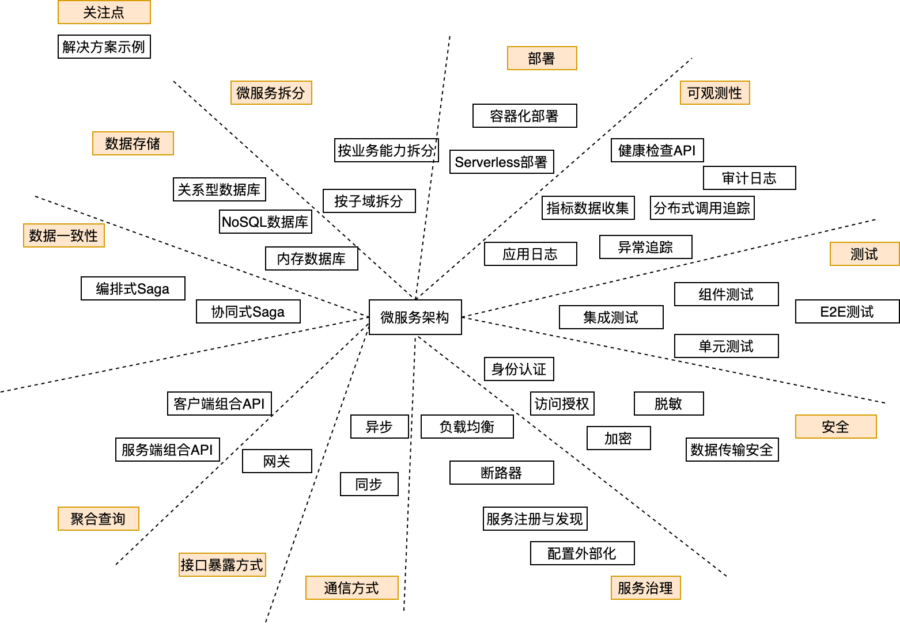

在微服务开发和设计过程中，除了要关注单体服务的问题，如部署模式、日志、服务健康监测等，同时还要关注分布式服务特有的问题，如数据一致性、链路跟踪等。

为了帮助设计和开发人员开发出一个高质量的基于微服务架构的应用，本篇文章介绍了在微服务的设计和开发过程中需要关注的问题。一般，这些问题都需要在系统设计阶段给出相应的解决方案。

(1)微服务拆分模式

- 按子域拆分：采用DDD方法论根据领域的子域进行拆分
- 按业务能力拆分：直接根据业务功能划分

还有一些其他的微服务拆分方式，如根据业务名词进行拆分。

(2)部署

微服务的部署需要借助完善的DevOps，而设计和开发人员主要考虑的是微服务的部署方式。部署方式有很多种，如

- 容器化部署：如使用docker部署
- Serverless部署：如使用AWS Lambda进行Serverless部署
- 使用发布包格式部署：如直接使用Jar包部署

(3)可观测性

可观测性主要用于线上运维和问题定位，如收收集服务器的资源利用率、微服务的每秒请求次数和响应时间、问题告警等，需要借助多种解决方案来实现可观测性，包括：

- 应用日志：将日志收集到统一的日志中心，以便分析问题时检索日志
- 指标数据收集：收集服务器和应用的指标信息，如微服务的请求响应时间、服务器的内存使用率
- 异常追踪：收集服务异常信息并过滤重复的异常信息，同时向开发人员告警
- 分布式调用追踪：为每一个在服务间跳转的外部请求分配唯一ID，并跟踪请求
- 健康检查API：公开的接口，用于返回服务器的运行状况
- 审计日志：记录用户操作

(4)测试

主要指自动化测试，测试的主要目的是保障开发质量，同时可以迫使开发人员开发出可测试的应用。测试包括：

- 单元测试：主要是针对类的测试
- 集成测试：验证服务是否可以和基础设施（如数据库）和其他服务进行正确的交付
- 组件测试：从业务（如story）视角出发的验收测试
- E2E测试：整个应用程序的验收测试

(5)安全

安全包括安全和隐私保护两个方面，除了要考虑身份认证和访问授权外，还要考虑用户的隐私数据保护，如用户身份证号。可以使用如下解决方案：

- 身份认证：验证用户身份是否可以登录应用
- 访问授权：验证用户是否允许执行当前请求
- 加密：主要用于加密数据库中的用户隐私数据和服务的敏感配置项（如数据库连接密码），使用时在内存中解密
- 脱敏：对日志中应用系统的敏感信息和用户隐私信息进行脱敏，向第三方应用发送数据时对数据进行脱敏
- 数据传输安全：以安全的方式在公网和内网中传递数据

(6)服务治理

在开发微服务时一般会选择一个微服务开发框架，如Spring Cloud，一个微服务框架一般会提供组件包括：

- 负载均衡：微服务间调用时的负载均衡
- 断路器：如果一个微服务实例因为故障不可用或具有高延迟时，接下来的请求将不会路由到该微服务实例，走到其恢复正常。断路器可以防止跨多个服务的故障级联，同时有助于构建容错和弹性的系统。
- 服务注册与发现：微服务启动时向注册中心注册自己的IP和端口号，消费端通过注册中心（或本地缓存）中定位到服务提供方的IP和端口号。服务注册与发现有助于构造松散耦合和可扩展的微服务应用。
- 配置外部化：将微服务的配置放到一个单独的配置中心（或服务），通过拉取或推送的方式变更各微服务实例的配置，可以实现无需重新部署即可变更微服务实例配置。

(7)通信方式

主要指微服务实例进程间的通信方式，包括：

- 同步：消费端需要服务端实时响应，消费端在等待服务端响应时可能导致堵塞
- 异步：消费端请求不会阻塞进程，服务端的响应可以是非实时的，如用于数据的最终一致性

(8)接口暴露方式

出于安全和网络的原因，一般并不会直接将微服务的接口暴露给外部系统（包括UI）。目前采用的主要方式是通过网关暴露微服务接口：

- 网关：即API Gateway，即可以通过微服务接口的组合调用实现复杂的查询操作，还可以实现一些边缘功能，如统一的用户认证。

(9)聚合查询

相对于单体架构，在微服务架构中，数据是分布在各个微服务中的，如果UI端的某一个功能需要从多个微服务中获取数据 ，一般的做法包括：

- 客户端组合API：UI端组合调用服务端提供的细粒度的API来完成数据获取，这种做法将业务暴露给了UI端，会导致UI端与服务端的过耦合
- 服务端组合API：由服务端组合微服务API的调用并返回最终的结果，因此服务端可以提供粗粒度的API，后续接口变更的联调成本会更低。通常通过API Gateway实现服务端组合API

(10)数据一致性

> Saga：一种消息驱动的本地事务序列，通过使用**异步消息**来协调一系列本地事务（ACID)，从而维护多个服务之间的**数据一致性**。

单体架构中可以利用数据库的ACID特性实现数据的强一致性，但是在微服务架构中，一个业务功能往往是由分布在不同微服务实例中的多个事务性操作组成，因此无法利用数据库的ACID特性来实现数据的强一致性。一般，在分布式架构中对数据的一致性要求降低为最终一致性，一般的解决方案（参考《微服务架构设计模式》）是：

- 编排式Saga：把Saga的决策和执行顺序逻辑集中在一个Saga编排器类中。Saga编排器发出命令式消息给各个Saga参与方，指示这些参与方服务完成具体操作（本地事务）。编排式最终将业务建模为**状态机**
- 协同式Saga：把Saga的决策和执行顺序逻辑分布在Saga的每一个参与方中，它们通过交换事件的方式来进行沟通

（11）数据存储

微服务架构中，每个微服务都有独立的数据库，需要根据各个微服务的业务特点选择合适的数据库：

- 关系型数据库：如MySQL
- NoSQL数据库：如MongoDB
- 内存数据库：如Redis

在后续的文章中，将从理论与实践两个方面对上述内容进行一一讲解。
